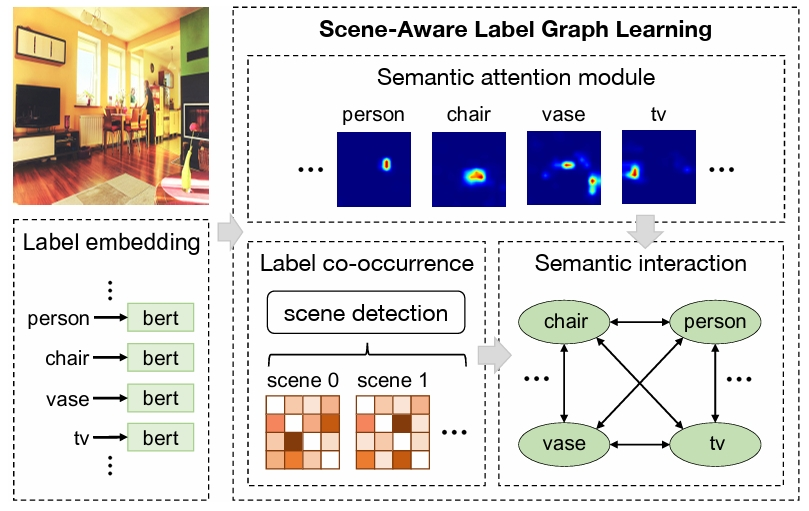
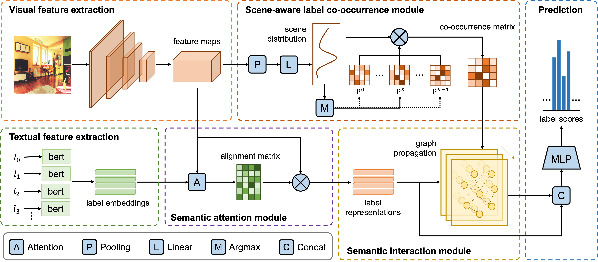
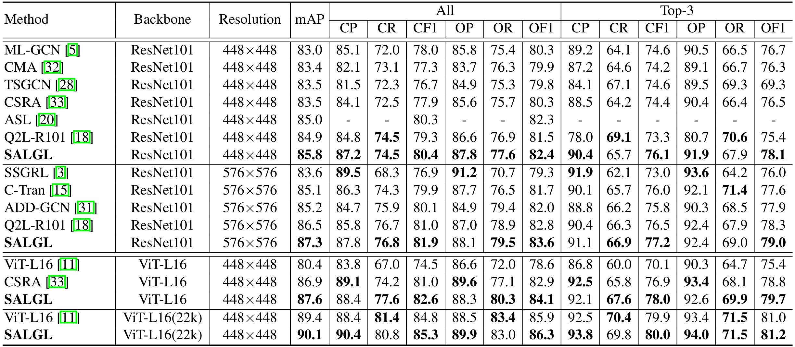

# SALGL
 Unofficial PyTorch implementation of the paper [Scene-Aware Label Graph Learning for Multi-Label Image Classification. ICCV 2023](https://openaccess.thecvf.com/content/ICCV2023/html/Zhu_Scene-Aware_Label_Graph_Learning_for_Multi-Label_Image_Classification_ICCV_2023_paper.html)


## Abstract
 Multi-label image classification refers to assigning a set of labels for an image. One of the main challenges of this task is how to effectively capture the correlation among labels. Existing studies on this issue mostly rely on the statistical label co-occurrence or semantic similarity of labels. However, an important fact is ignored that the cooccurrence of labels is closely related with image scenes (indoor, outdoor, etc.), which is a vital characteristic in multi-label image classification. In this paper, a novel scene-aware label graph learning framework is proposed, which is capable of learning visual representations for labels while fully perceiving their co-occurrence relationships under variable scenes. Specifically, our framework is able to detect scene categories of images without relying on manual annotations, and keeps track of the co-occurring labels by maintaining a global co-occurrence matrix for each scene category throughout the whole training phase. These scene-independent co-occurrence matrices are further employed to guide the interactions among label representations in a graph propagation manner towards accurate label prediction. Extensive experiments on public benchmarks demonstrate the superiority of our framework.


## Motivation and framework
 A brief illustration of the proposed scene-aware label graph learning framework.


The overall architecture of the proposed Scene-Aware Label Graph Learning


## Results on MS-COCO



## Reproducing result
|DataSet                   | Author | Reproducing |
|:----:                    | :----: | :---------: |
|MS-COCO                   |  85.75 |    85.75    |
|VOC 2007                  |  -     |      -      |
|VOC 2007 pretrain on COCO |  -     |      -      |
|NUS-WIDE                  |  66.34 |     66.24   |

## Prerequisites

Python 3.8

Pytorch 1.8.1

CUDA 11.6

RTX3090 × 1

## Datasets

- MS-COCO: [train](http://images.cocodataset.org/zips/train2014.zip)  [val](http://images.cocodataset.org/zips/val2014.zip)  [annotations](http://images.cocodataset.org/annotations/annotations_trainval2014.zip)
- VOC 2007: [trainval](http://host.robots.ox.ac.uk/pascal/VOC/voc2007/VOCtrainval_06-Nov-2007.tar)  [test](http://host.robots.ox.ac.uk/pascal/VOC/voc2007/VOCtest_06-Nov-2007.tar)  [test_anno](http://host.robots.ox.ac.uk/pascal/VOC/voc2007/VOCtestnoimgs_06-Nov-2007.tar)

## Train

```
bash scripts/SALGL/coco.sh
```


## Citation

- If you find this work is helpful, please cite the paper

```
@inproceedings{zhu2023scene,
    title     = {Scene-aware label graph learning for multi-label image classification},
    author    = {Zhu, Xuelin and Liu, Jian and Liu, Weijia and Ge, Jiawei and Liu, Bo and Cao, Jiuxin},
    booktitle = {Proceedings of the IEEE/CVF International Conference on Computer Vision (ICCV)},
    pages     = {1473--1482},
    month     = {October},
    year      = {2023}
}
```
